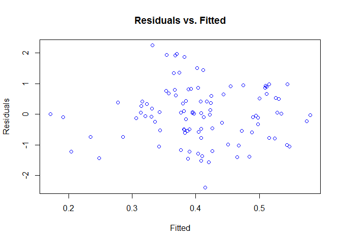

### A Bayesian Linear Regression package

Bayesian linear regression is a way of doing linear regression, were bayesian statistics are used to do the prediction.

This package is built in RStudio to do Bayesian linear regression, as a part of the course "Data Science in Bioinformatics: Software Development and Testing", in Aarhus University 2016. The goal of the project was to see the various aspects that go into building an R package.

### Installation and usage

First, install the devtools package. Then install the blm package from Github: install\_github("steinunngroa/blm").

### Functions

There are 10 functions available for users of the package. To get information on each function and the usage, type into Rstudio: ?function\_name.blm, for example ?deviance.blm. .

-   blm() The function fits a blm model, using a model formula, and optional additional data.
-   coef() This function returns the fitted parameters of the model.
-   confint() This function finds the confidence intervals for the blm fitted parameters.
-   fitted() This function produces fitted response variables.
-   residuals() This function returns the residuals of a blm.
-   deviance() This function finds the deviance for a blm.
-   plot() This function produces a plot for a given blm.
-   predict() This function makes a prediction based on the fitted model.
-   print() This function prints out a summary of a blm model
-   summary() This function gives a summary of a blm regression model, using the print.blm function.

Then there are three support functions used. One to make a prior, another to update to a posterior and the third to give a responseless model matrix.

-   make\_prior() This function produces a prior distribution, using the parameter alpha and the model given as input.
-   update() This function updates a prior distribution, to get the posterior distribution.
-   model\_matrix\_responseless() This function removes the response variable from a matrix and returns a responseless matrix.

### Example of usage

``` r
# Making of random data for the test
alpha = 1; beta = 1;
w0 = 0.4; w1 = 0.2; w2 = 0.1;
d1 = data.frame(x=rnorm(100), z = rnorm(100));
d1$y = rnorm(100, w0-w1*d1$x+w2*d1$z, 1/beta)
m1 = y ~ x + z

# Using make_prior and blm to construct a valid blm
prior1 = make_prior(m1, alpha)
blm1 = blm(m1, prior1, beta, d1)

# Using coef, confint and fitted
coef1 = coef(blm1)
confint1 = confint(blm1, c("(Intercept)", "x", "z"), level = 0.9)
fit1 = fitted(blm1)

# Showing usage of residuals, deviance and predict
res1 = residuals(blm1)
dev1 = deviance(blm1)
pred1 = predict(blm1, d1)

# Printing, plotting and doing a summary
print(blm1)
```

    ## [1] "Function usage:"
    ## blm(m1, prior1, beta, d1)
    ## 
    ## Model:
    ## y ~ x + z
    ## 
    ## Mean:
    ##                   [,1]
    ## (Intercept) 0.39803939
    ## x           0.06070363
    ## z           0.06998730
    ## 
    ## Sigma:
    ##               (Intercept)             x            z
    ## (Intercept)  0.0101290168 -0.0002008859 -0.001528724
    ## x           -0.0002008859  0.0107601111  0.002145296
    ## z           -0.0015287238  0.0021452963  0.010309037

``` r
plot(blm1)
```



``` r
summary(blm1)
```

    ## 
    ## BLM details
    ## [1] "Function usage:"
    ## blm(m1, prior1, beta, d1)
    ## 
    ## Model:
    ## y ~ x + z
    ## 
    ## Mean:
    ##                   [,1]
    ## (Intercept) 0.39803939
    ## x           0.06070363
    ## z           0.06998730
    ## 
    ## Sigma:
    ##               (Intercept)             x            z
    ## (Intercept)  0.0101290168 -0.0002008859 -0.001528724
    ## x           -0.0002008859  0.0107601111  0.002145296
    ## z           -0.0015287238  0.0021452963  0.010309037
    ## 
    ## Residuals
    ##                [,1]
    ##   [1,]  0.797458280
    ##   [2,] -1.568731649
    ##   [3,]  0.866822880
    ##   [4,]  1.929355488
    ##   [5,] -0.039011958
    ##   [6,]  0.018857216
    ##   [7,]  0.511625397
    ##   [8,] -0.489196217
    ##   [9,] -1.380923944
    ##  [10,] -0.101769657
    ##  [11,] -1.522710851
    ##  [12,]  1.360683168
    ##  [13,]  0.979931931
    ##  [14,]  0.131897903
    ##  [15,]  0.349514198
    ##  [16,] -1.375994562
    ##  [17,] -0.089253649
    ##  [18,]  0.647243084
    ##  [19,] -1.204996719
    ##  [20,] -0.990650243
    ##  [21,]  0.013930865
    ##  [22,] -0.135360251
    ##  [23,] -2.401892111
    ##  [24,]  0.432308451
    ##  [25,] -1.448505495
    ##  [26,] -0.786209144
    ##  [27,]  0.045027595
    ##  [28,] -0.009294144
    ##  [29,] -0.278952341
    ##  [30,]  0.493408861
    ##  [31,]  1.878633955
    ##  [32,]  0.975206213
    ##  [33,] -0.545094535
    ##  [34,]  0.936201486
    ##  [35,] -0.481883092
    ##  [36,]  0.067209643
    ##  [37,]  0.051629165
    ##  [38,]  0.419322839
    ##  [39,] -0.453222826
    ##  [40,]  0.379510946
    ##  [41,] -0.168060468
    ##  [42,]  0.834417868
    ##  [43,]  0.031761916
    ##  [44,]  1.931461968
    ##  [45,] -0.518121211
    ##  [46,] -1.228689932
    ##  [47,] -0.325763859
    ##  [48,]  0.095005340
    ##  [49,]  0.062183516
    ##  [50,] -1.444485963
    ##  [51,] -0.497956185
    ##  [52,]  1.965407911
    ##  [53,] -0.078617319
    ##  [54,]  0.950426003
    ##  [55,] -1.292367348
    ##  [56,]  0.606280491
    ##  [57,] -0.744027630
    ##  [58,]  0.414508418
    ##  [59,] -0.598086868
    ##  [60,] -0.609514855
    ##  [61,] -0.736299210
    ##  [62,]  0.004135327
    ##  [63,] -0.776324451
    ##  [64,]  0.806564240
    ##  [65,]  2.244947718
    ##  [66,]  0.858346285
    ##  [67,] -0.537786362
    ##  [68,]  0.607600754
    ##  [69,]  0.662090054
    ##  [70,] -0.528836985
    ##  [71,] -1.059333583
    ##  [72,]  0.411955506
    ##  [73,] -1.006519752
    ##  [74,]  0.332356685
    ##  [75,]  1.511727106
    ##  [76,] -0.252636832
    ##  [77,]  0.766271227
    ##  [78,] -0.104275053
    ##  [79,] -0.767616009
    ##  [80,]  0.678074949
    ##  [81,] -0.064207197
    ##  [82,]  0.915033841
    ##  [83,] -1.025270916
    ##  [84,] -0.114292466
    ##  [85,]  0.368422932
    ##  [86,]  1.336157736
    ##  [87,] -0.233832652
    ##  [88,] -0.575395915
    ##  [89,] -1.405412233
    ##  [90,] -1.163936475
    ##  [91,]  0.031420769
    ##  [92,]  0.261245704
    ##  [93,]  1.441768781
    ##  [94,] -1.218974189
    ##  [95,]  0.537678668
    ##  [96,] -1.062996145
    ##  [97,] -0.028266015
    ##  [98,]  0.044343244
    ##  [99,]  0.890864629
    ## [100,]  0.185278924
    ## 
    ## Deviance
    ## [1] 81.18566

Reference
---------

Mailund, T. "Introduction to Data Science and Statistical Programming in R"
